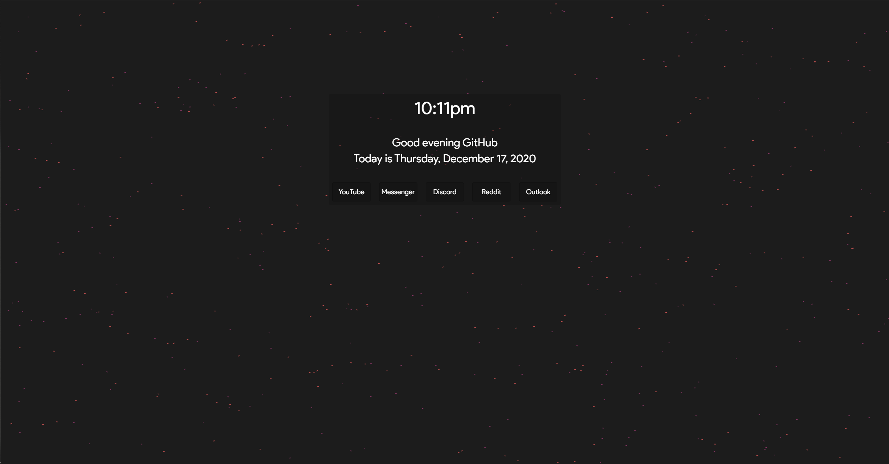

# Startpage by Vinodh N.
A simple new tab interface with a flow field in the background

### What is this?
This is a new-tab replacement extension for Chromium based browsers. Based on the work by llamasking and utilizing the flow field simulation created by Fabio Ottabini, this extension replaces the default new tab that Chrome creates with a simple calendar, clock, and 5 pre-made shortcuts.

### How to setup
- Clone the repository and note down the directory

- In your Chromium-based browser, go to the extensions management page

    - e.g. `chrome://extensions` or `edge://extensions`

- Enable developer mode and then click on `Load Unpacked`.

- Navigate to the folder you cloned to and open it.

- A pop-up will then ask you for your name

That's it!